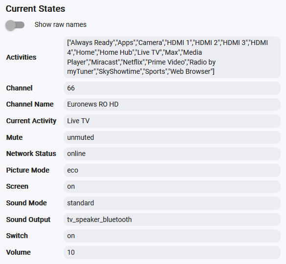
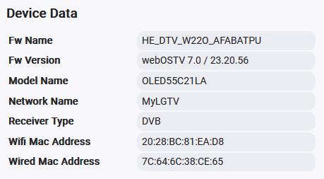

# LGTV with webOS

Hubitat driver to control LG TV devices using webOS websockets.

Tested devices:
- LG OLED evo C2 55 inch (OLED55C21LA, 2022) - webOSTV 7.0 / 23.20.56
- LG OLED evo C2 48 inch (OLED48C21LA, 2022) - webOSTV 7.0 / 23.20.56

## Installation
There are two ways to install the drivers: using Hubitat Package Manager (HPM) or manually importing the driver code.

### HPM Installation (Recommended)
HPM is an app that allows you to easily install and update custom drivers and apps on your Hubitat hub. To use HPM, you need to have it installed on your hub first.

Once you have HPM installed, follow these steps to install the "LGTV with webOS" driver:

1. In the Hubitat interface, go to **Apps** and select **Hubitat Package Manager**.
1. Select **Install**, then **Search by Keywords**.
1. Enter **LGTV** in the search box and click **Next**.
1. Select **LGTV with webOS by Dan Danache** and click **Next**.
1. Follow the install instructions.

### Manual Installation
If you prefer not to use HPM, you can manually install the drivers by importing the driver code from GitHub:

1. In the Hubitat interface, go to **Drivers Code**.
1. Click **Add driver**, then select **Import** from the hamburger menu in the top right.
1. Enter `https://raw.githubusercontent.com/dan-danache/hubitat/main/lgtv-drivers/lgtv-with-webos.groovy` it in the URL field.
1. Click **Import**, then click **OK** and the code should load in the editor.
1. Click **Save** in the top right.

For more information on installing custom drivers, refer to the [Official Documentation](https://docs2.hubitat.com/en/how-to/install-custom-drivers).

## Create Devices

Follow these steps to create a new LG TV device:

### Configure IP address
1. Open your router's admin interface and set a static DHCP lease for your TV devices to ensure they always have the same IP addresses on your LAN.

1. Ensure the TV and the Hubitat hub are on the same subnet for Wake-On-LAN functionality to work.

### Configure TV
1. Ensure you are near your TV device, as this cannot be done remotely.
1. Power on the TV and open the TV settings.
1. Find and disable the **Always Ready** option (for OLED screens).
1. Enable the **Network IP Control** option.
1. Keep TV on for the following steps.

### Add device
1. In the Hubitat interface, go to **Devices**.
1. Click **Add device**, then select **Virtual**.
1. Select **LGTV with webOS** from the drivers list, then click **Next**.
1. Name your device (e.g., Livingroom TV), select a room, then click **Next**.
1. Click **View device details** to go to the device page.
1. Select the **Preferences** tab.
1. Enter the TV IP address, then click **Save**.
1. Approve the notification that appears on your TV screen.
1. A toast notification should appear briefly on your TV screen saying **Well done! Configuration is now complete**.
1. Select the **Commands** tab, then refresh the browser page to reload the attributes list.
1. If the **Current States** section does not populate with multiple attributes, check the Hubitat logs for clues. Debug messages are displayed for 30 minutes, then the log level automatically switches to Info.

## Control options

The following commands are available:

### Power control
- On / Off

### Sound volume control
- Volume Up / Volume Down
- Set Volume (0% - 100%)
- Mute / Unmute
- Set Sound Output (tv_speaker, external_arc, external_optical, bt_soundbar, mobile_phone, lineout, headphone, tv_speaker_bluetooth)

### Live TV channel control
- Channel Up / Channel Down
- Set Channel

### Screen control
- Screen On / Screen Off
- Set Picture Mode (cinema, eco, expert1, expert2, game, normal, photo, sports, technicolor, vivid, hdrEffect, filmMaker, hdrCinema)

### App control
- Get All Activities - Populate the **Activities** attribute with available options for the **Start Activity** command
- Get Current Activity - Not actually needed as the current activity (running app) is automatically detected
- Start Activity - Start the specified app on the TV
- Start Video - Play the specified video file in Media Player app
- Start Web Page - Open the specified URL in Web Browser app

### Notifications
- Device Notification - Display toast or an alert notifications to the TV screen

## Notes

#### Wake On LAN
When the TV is first paired with the Hubitat, the driver will attempt to auto-enable the Wake-On-LAN (WOL) settings on your TV.

#### Detect TV start
When the TV is turned on using its remote, it does not broadcast any message to the LAN. To overcome this, the driver pings the TV's IP address at the frequency set in the **Preferences** tab. The default ping interval is 5 minutes, so it can take up to 5 minutes for the driver to detect that the TV was turned on.

Have fun!

---

