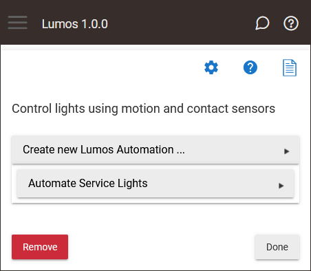
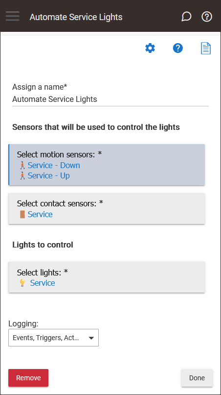

# Lumos

Control lights using motion and contact sensors.

## Installation

To install the Lumos app using the Hubitat Package Manager (and receive automatic updates), follow these steps:

1. Go to the **Apps** menu in the Hubitat interface.
2. Select **Hubitat Package Manager** from the list of apps.
3. Click **Install** and then **Search by Keywords**.
4. Type **Lumos** in the search box and click **Next**.
5. Choose **Lumos by Dan Danache** and click **Next**.
6. Read the license agreement and click **Next**.
7. Wait for the installation to complete and click **Next**.

## Usage

To use the Lumos app, follow these steps:

1. Go to the **Apps** menu in the Hubitat interface.
2. Select **Lumos** from the list of apps.

### Lumos (parent app)

From the Lumos parent app you can add and edit your Lumos Automations child instances.

### Lumos Automation (child instance)

Use a Lumos Automation child instance to control one or more lights based on input from the selected motion and contact sensors.

---

