# Watchtower

*Data-driven insights for a smarter home.*

Watchtower is the all-in-one app for long-term smart home monitoring and data visualization.

Staying true to Hubitat's core value, the application works 100% locally, without any dependence on the Internet or cloud services. Plus, you **don't have** to fiddle with extra hardware like Raspberry Pi or NAS, or configure and maintain complex software like Docker containers, Prometheus, InfluxDB, Grafana, etc. Just install the Watchtower app on your Hubitat hub, and it seamlessly handles the rest.

## Installation

### Install using HPM
To install the Watchtower app using the Hubitat Package Manager (and receive automatic updates), follow these steps:

1. Go to the **Apps** menu in the Hubitat interface.
1. Select **Hubitat Package Manager** from the list of apps.
1. In the top-right, make sure that you have at least version **1.9.2** installed; otherwise, first update HPM to its latest version.
1. Click **Install** and then **Search by Keywords**.
1. Type **Watchtower** in the search box and click **Next**.
1. Choose **Watchtower by Dan Danache** and click **Next**.
1. Read the license agreement and click **Next**.
1. Wait for the installation to complete and click **Next**.

### Manual install

#### Add application code

1. Go to the **Apps code** menu entry in the Hubitat interface.
1. Click the **+ New app** button in the top right.
1. Click the **Import** button in the top right.
1. Insert the following URL: `https://raw.githubusercontent.com/dan-danache/hubitat/main/watchtower-app/watchtower.groovy`
1. Click **Import** and then **OK** when prompted.
1. Click the **Save** button in the top right.
1. Click the **OAuth** button in the top right.
1. Click the **Enable OAuth in App** button.
1. Click the **Update** button in the bottom right.

#### Add dashboard resource files

1. Download the [watchtower.html](https://raw.githubusercontent.com/dan-danache/hubitat/main/watchtower-app/watchtower.html) file from GitHub on your Desktop.
1. Download the [watchtower.js](https://raw.githubusercontent.com/dan-danache/hubitat/main/watchtower-app/watchtower.js) file from GitHub on your Desktop.
1. Go to the **Settings** menu entry in the Hubitat interface.
1. Select **File Manager** from the list.
1. Click the **+ Choose** button.
1. Locate and select the **watchtower.html** file from your Desktop.
1. Click the **Upload** button.
1. Click the **+ Choose** button.
1. Locate and select the **watchtower.js** file from your Desktop.
1. Click the **Upload** button.

#### Create application instance

1. Go to the **Apps** menu entry in the Hubitat interface.
1. Click the **+ Add user app** button in the top right.
1. Select **Watchtower x.y.z** from the list.

#### Start the application

1. Go to the **Apps** menu entry in the Hubitat interface.
1. Select **Watchtower x.y.z** from the apps list.

## Metrics Collection

The application utilizes a fixed-size database, similar in design and purpose to an RRD (Round-Robin Database). This setup allows for high-resolution data (minutes per point) to gradually degrade into lower resolutions for long-term retention of historical data.

The following time resolution are used:

- **5 minutes**: Attribute value in the last 5 minutes
- **1 hour**: Average attribute value over the last hour
- **1 day**: Average attribute value over the last day
- **1 week**: Average attribute value over the last week

### How it Works

1. **Every 5 minutes**: The application calculates the 5-minutes value for all configured device attributes and stores this data in the **File Manager** using CSV files named `wt_${device_id}_5m.csv`, one file per configured device. Only devices configured in the application's **Devices** screen are queried.

1. **At the start of every hour**: The application reads the data from each device's `wt_${device_id}_5m.csv` file, selects records from the last hour, calculates the averages, and saves them in CSV files named `wt_${device_id}_1h.csv`.

1. **At midnight daily**: The application reads the data from each device's `wt_${device_id}_5m.csv` file, selects records from the last day (00:00 - 23:59), calculates the averages, and saves them in CSV files named `wt_${device_id}_1d.csv`.

1. **At midnight every Sunday**: The application reads the data from each device's `wt_${device_id}_1h.csv` file, selects records from the last week (Monday 00:00 - Sunday 23:59), calculates the averages, and saves them in CSV files named `wt_${device_id}_1w.csv`.

**Note**: To maintain a fixed file size, old records are discarded during each save, as specified in the **Settings** screen.

## Usage

To use the Watchtower app, follow these steps:

1. Go to the **Apps** menu in the Hubitat interface.
1. Select **Watchtower** from the list of apps.

### Main Screen

When you open the Watchtower app, the following screen will welcome you.

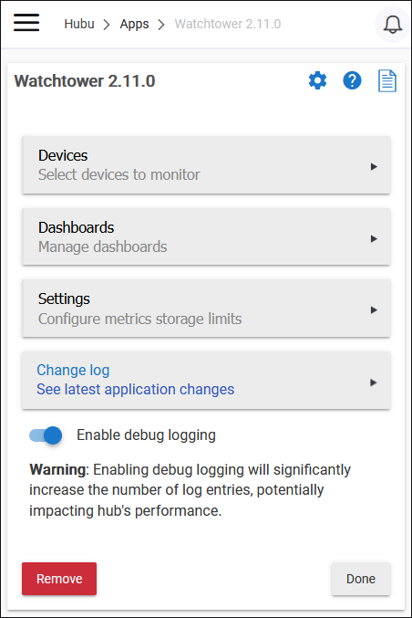

### Devices Screen

On this screen, you can configure which smart devices will be monitored by the Watchtower app.

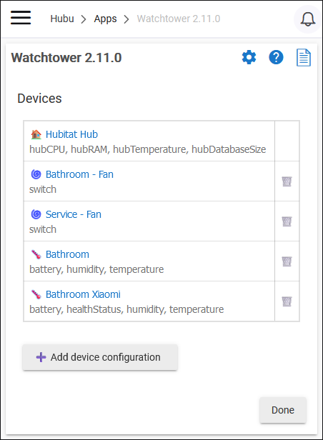

Click the **Add device configuration** button to start monitoring a new device. You will be prompted to select a device and then select what device attributes (from device Current State) you want to monitor.

**Note**: Not all device attributes are supported. Only the [official attributes](https://docs2.hubitat.com/en/developer/driver/capability-list) will be available for selection.

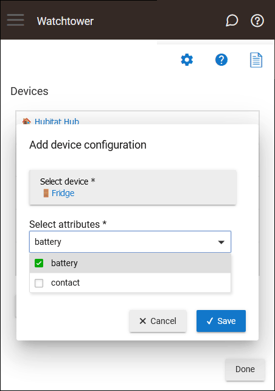

After you click the **Save** button, the application will start to periodically (every 5 minutes) save the selected attributes in a CSV file that you can download from the **File Manager**.

Links to the CSV files are available from the **View device** screen.

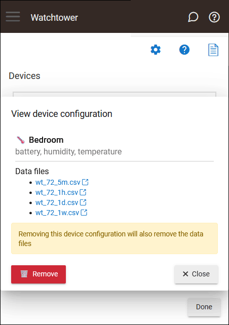

From this screen, you also have the option to remove the device configuration. Once you click the **Remove** button, the application will stop collecting metrics for this device. The CSV files are also removed from the **File Manager**.

### Dashboards Screen

From the dashboards screen, you can add, rename and delete dashboards for the configured devices. Clicking the dashboard name, will open the specified dashboard in a new tab and you can add and remove tiles for the selected dashboard.

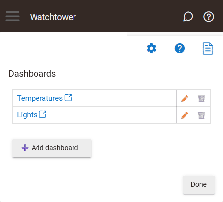

Click the **Done** button on the bottom-right to return back to the main screen.

### Settings Screen

From the settings screen, you can configure how long the collected metrics are stored for each time resolution.

**Caution**: Changing the "max record" settings will directly impact the CSV files size for every configured device. Loading of dashboard tiles will also be slower if you increase the default values since more data needs to be downloaded from the hub.

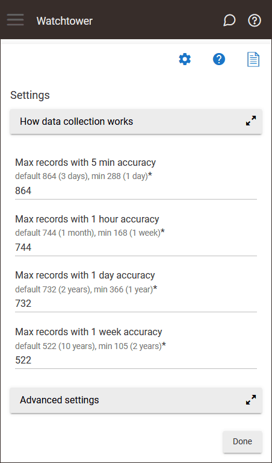

Click the **Done** button on the bottom-right to save the configuration and return back to the main screen.

## Dashboard Configuration

When you load a dashboard in a new tab for the first time (by clicking the dashboard name in the Watchtower app), a blank screen will appear where you can add multiple tiles.

**Note**: If you have just configured new monitored devices in the Watchtower app, there may not be enough data collected to display on the dashboard tiles. If a chart displays the **No data yet** message, don't worry. Simply check back later (e.g., in a day or two) to allow the application to collect sufficient data points.

### Dashboard Menu

The dashboard menu is not displayed by default and will only appear when the dashboard has no tiles. To toggle the dashboard menu, press the **ESC** (Escape) key on your keyboard. On mobile devices, you can bring up the menu by swiping from the left margin of the screen.

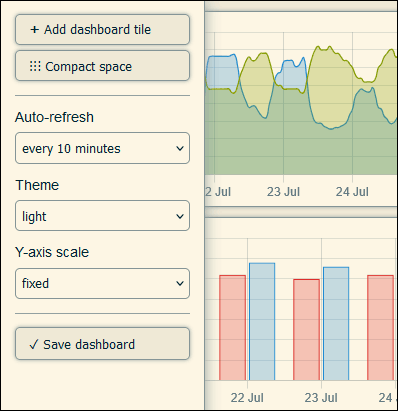

From the dashboard menu on the left, you can add a new dashboard tile, save the current dashboard layout, or configure the auto-refresh interval.

**Important**: Changes to the dashboard layout are not saved automatically! When you are satisfied with the dashboard layout, you must click the **Save dashboard** button.

### Supported Dashboard Tiles

The following dashboard tile types are currently supported:

- **Device** - Renders a chart with one or two attributes for a selected device. If you select a second attribute, its scale is shown on the right side of the chart.

   Example usage: chart temperature and humidity for a specific device.

   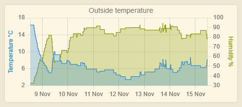

- **Attribute** - Renders a chart with the selected attribute, from multiple devices.

   Example usage: chart temperature from 2 devices (inside vs. outside).

   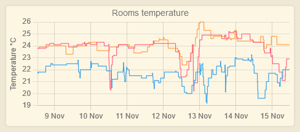

- **Text** - This tile type renders plain or HTML text.

   Example usage: add a navigation tile with links to other dashboards (using HTML code).

   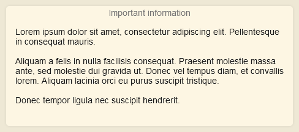

- **Iframe** - This tile type renders an embedded web page from a specified URL.

   Example usage: load a widget (clock, weather, video feed, etc.) from another location.

   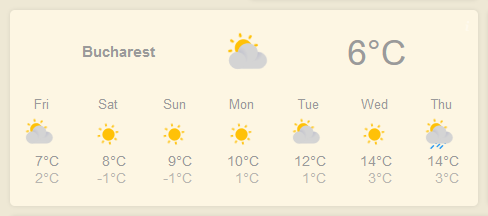

- **Hub Info** - This tile type renders information about the Hubitat hub.

   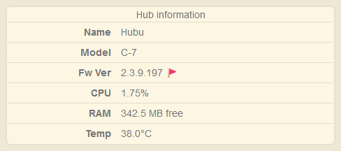

### Manage Dashboard Tiles

- Rearrange tiles by dragging their title. Resize tiles by dragging the bottom-right corner.

- Remove tiles by moving them outside the dashboard grid.

- Dashboard tiles cannot be edited. If you selected the wrong device/attribute or want to change the tile title, remove it and add it again with the correct configuration.

> **Important**: Changes are not automatically saved! Remember to click the **Save dashboard** button when you are satisfied with the dashboard layout.

### Chart Time Resolution

When you move your mouse over a chart, the time resolution picker is displayed at the bottom. You can switch between 5-minute, 1-hour, 1-day, and 1-week resolutions.

Changing the time resolution updates the source of the graph data points. For example, selecting the "1h" resolution loads chart data from the `wt_${device_id}_1h.csv` file in the File Manager.

### Chart Zoom

The zoom functionality allows you to interact with charts displaying multiple data points over time. To zoom in on a specific chart area, simply select it using your mouse. To return to the full dataset view, click the **Reset Zoom** button (◀•••▶) in the top right corner.

On mobile devices, start by tapping the chart briefly, then immediately drag the desired chart area to zoom in.

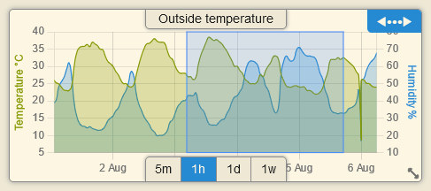

### Line vs Bar Charts
Charts will automatically switch between line and bar types based on the number of data points visible. When fewer data points are displayed (e.g., when zoomed in or when time resolution is changed), the chart switches to a bar type for better visibility. When more data points are available, a line chart is more suitable for data analysis.

### Auto-refresh

Using the left dashboard menu, select the desired auto-refresh interval.

### Themes Support
Dashboards can be configured to use a light or dark theme. You can change the theme from the dashboard menu.

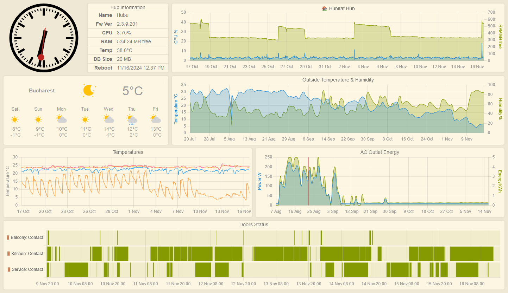

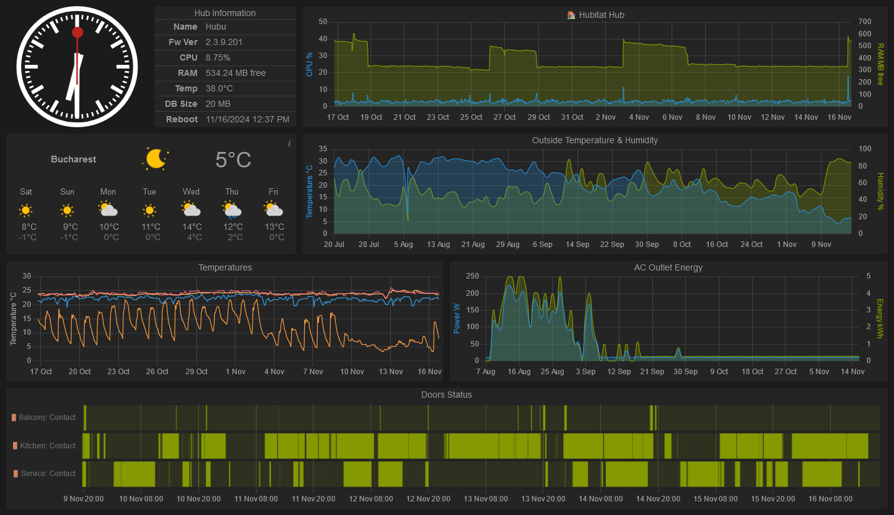


## Advanced Usage

### Disable Automatic Data Collection

Although **strongly discouraged**, you have the option to disable data collection and data aggregation processes (which run as scheduled tasks on the hub) from the **Settings** screen.

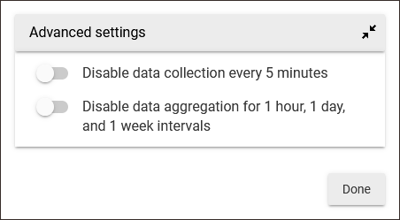

### On-demand Data Collection

The data collection process runs automatically every 5 minutes. To initiate on-demand data collection (e.g., from Rule Machine) for all configured devices, execute the following HTTP GET request against your hub's IP address:

```
GET /apps/api/${app_id}/collect-device-metrics?access_token=${access_token}&lookbackMinutes=${lookbackMinutes}
```

| Parameter       | Format           | Description                                                                                                        |
|-----------------|------------------|--------------------------------------------------------------------------------------------------------------------|
| app_id          | number, required | Watchtower app ID. Get this from the URL when the app is opened in Hubitat.                                        |
| access_token    | string, required | Watchtower app Access Token. Get this from the URL when you load a Watchtower dashboard.                           |
| lookbackMinutes | number, optional | How far back in time to look for device events when calculating the current data point (min=0, max=30, default=0). |

---
[](https://www.buymeacoffee.com/dandanache)
